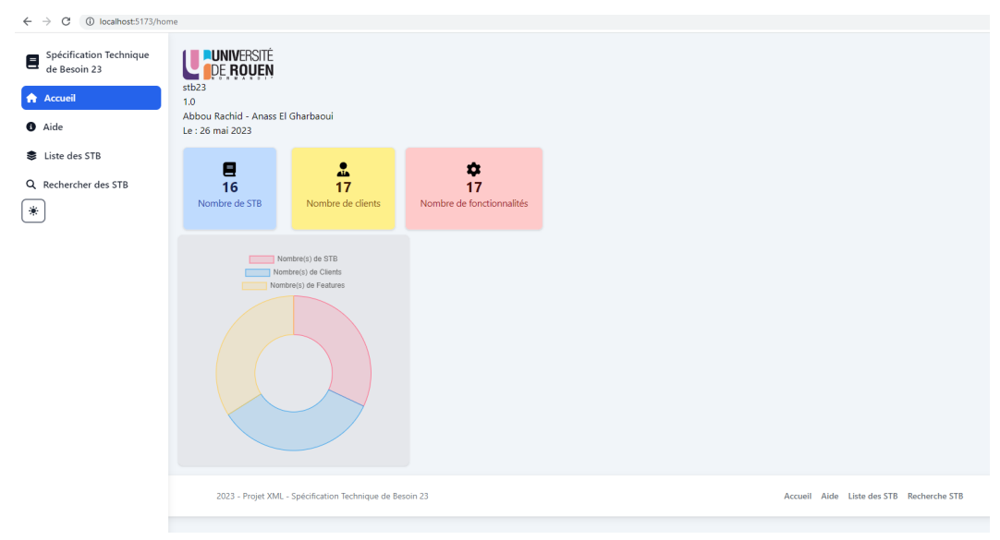
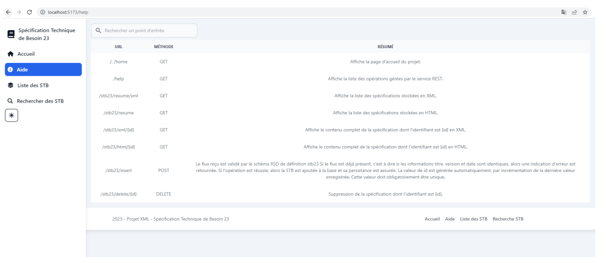
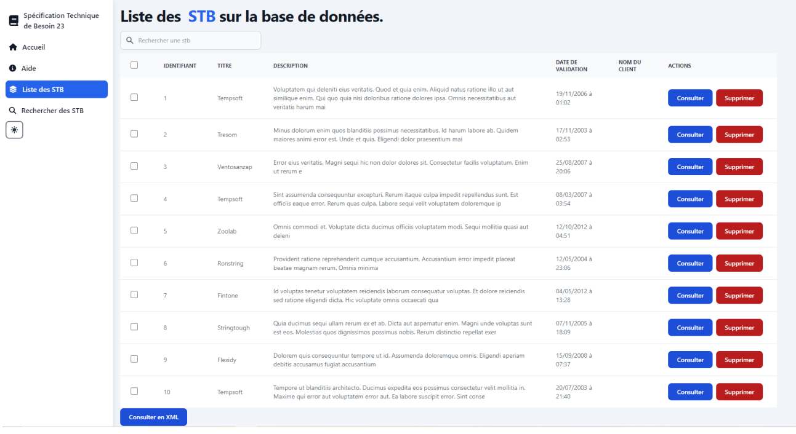
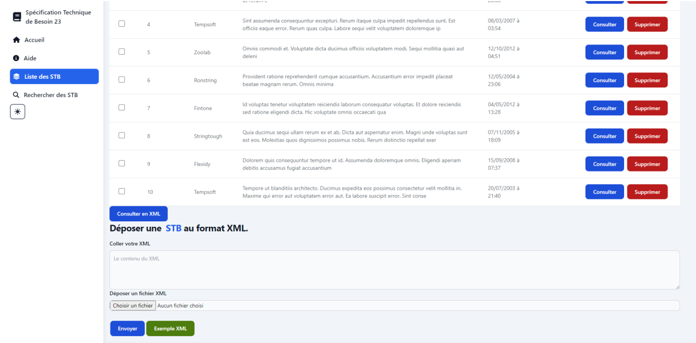
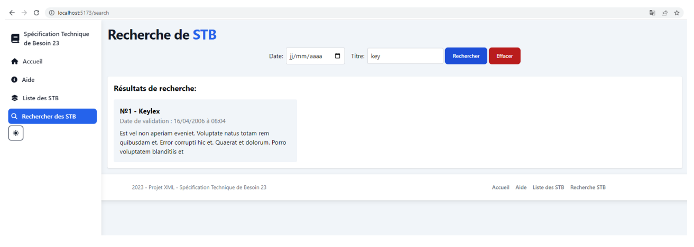
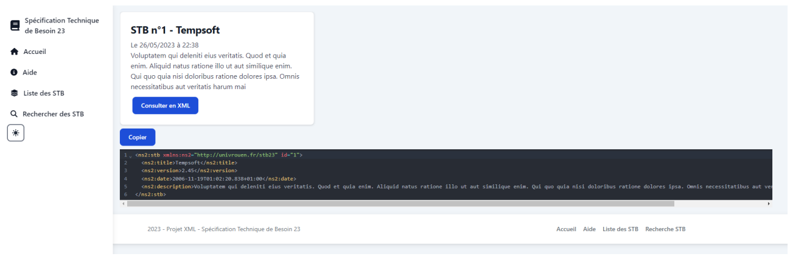
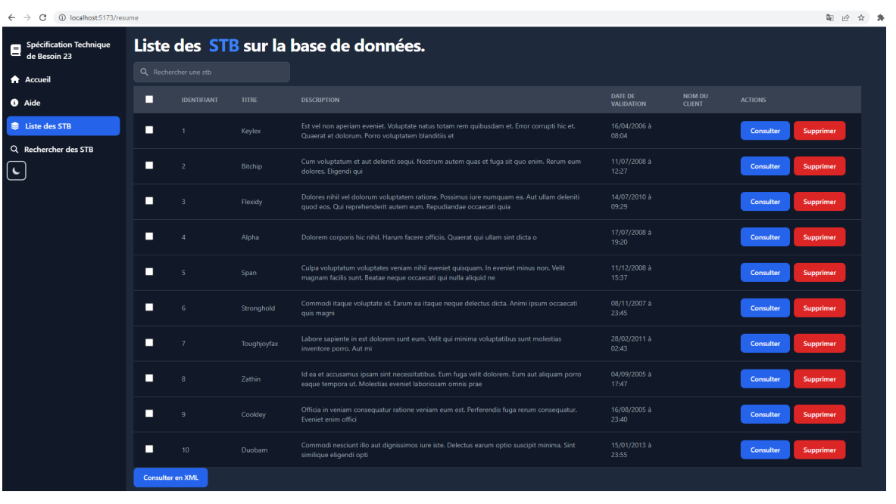

# Application STB23

L'application STB23 est un client permettant d'interagir avec une API REST pour gérer des STB (Spécifications Techniques de Besoin) au format XML. Elle a été développée en utilisant Vite.js et React, offrant ainsi une expérience de développement rapide et une interface utilisateur réactive.

## Installation

Pour installer et exécuter l'application STB23, suivez les étapes ci-dessous :

### Prérequis

Assurez-vous d'avoir les éléments suivants installés sur votre machine :

- Node.js (version 12 ou supérieure)
- npm

### Étapes d'installation

1. Clonez le dépôt GitHub de l'application STB23 :
   `git clone <url_du_dépôt>`

2. Accédez au répertoire du projet :
   `cd stb23`

3. Installez les dépendances du projet en exécutant la commande suivante :
   `npm install`

### Exécution en mode développement

Pour exécuter l'application en mode développement, utilisez la commande suivante :

`npm run dev`

### Configuration requête

Dans votre fichier de configuration `.env`, modifiez la variable `VITE_API_BASE_URL` en fonction de la phase de développement ou de production :

Comme nous sommes en phase de production pour tester l'api REST :

`VITE_API_BASE_URL=https://app-03f26cc3-7f6b-4531-bbf6-dd86db89c40c.cleverapps.io`

Cependant, si vous souhaitez utiliser l'api REST en local et le client aussi alors :

`VITE_API_BASE_URL=http://localhost:8080`

### Ne pas utiliser cette partie, car dans notre projet stb23, le client reste que en développement pour tester l'api rest déployer

### Mais on garde cette partie quand même car elle montre comment faire pour la production

Pour générer une version optimisée de l'application pour la production, exécutez la commande suivante :

`npm run build`

Les fichiers de production seront générés dans le répertoire `dist`.
